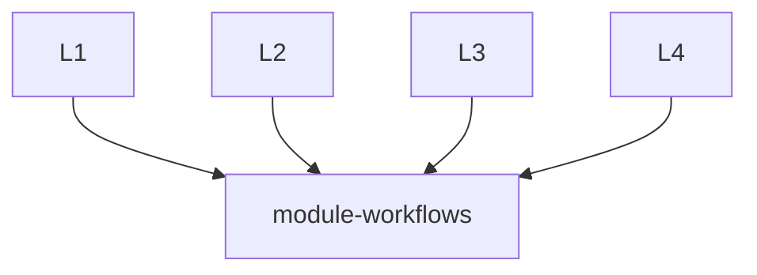

# Module Workflows
This repository provides re-usable workflows for Terraform repositories.

Calling workflows in this repository is done by adding the following to a workflow file in the calling repository:
```
jobs:
  call-workflow:
    uses: energyx-io/module-workflows/.github/workflows/<workflow-name>.yaml@main
    secrets: inherit
    with:
      <input>: <input-value>
```

More information about workflow re-use can be found here: https://docs.github.com/en/actions/using-workflows/reusing-workflows

## Architecture


All Terraform modules in the `energyx-io` organization can remotely call the reusable workflows declared here in `module-workflows`. Some SOPs for enabling this work can be found below.


## CI Workflow
The reusable CI workflow (`.github/workflows/CI.yaml`) abstracts the process of validating the correctness of Terraform modules before they are deployed. It also automates the release process should the CI process succeed. For more information about what's happening, view the workflow code directly.
